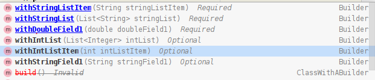

# Java Builder Pattern Guided Completion Intellij Plugin


[](https://plugins.jetbrains.com/plugin/15695)
[](https://plugins.jetbrains.com/plugin/15695)


<!-- Plugin description -->
This Intellij Plugin is designed to help you navigate the invocation of a [Builder](https://refactoring.guru/design-patterns/builder) class as part of the pattern with the same name.

It allows the creator of the Builder API to specify what methods are mandatory, what methods can be invoked more than once and more!

The user of the Builder API will have a guided experience through the auto-completion popup which will mark what methods are required, optional or invalid.

The home of the project together with its documentation is at https://github.com/banterly91/Java-Builder-Guided-Completion-Intellij-Plugin.
<!-- Plugin description end -->


## Usage
After setting up this plugin(see bellow), 3 annotations will be available for the Builder API author, and they should be used as follows:
##### @BuilderClass
Used to mark the builder class
```java
@BuilderClass
public class Builder{}
```
##### @BuilderMethod
Used to mark the public methods of the Builder class which will be used to pass the data required to build the target object.

This annotation comes with 3 attributes:

- ***type*** - it has 2 possible values
  - ***BuilderMethod.Type.MANDATORY*** to mark the methods that must be called in order for the Builder to have enough data to construct a valid object.
  - ***BuilderMethodType.OPTIONAL*** to mark methods as optional, the object can be constructed without them being invoked. This is the default value for the attribute.
```java
@BuilderClass
public class Builder {
// other Builder class code

@BuilderMethod(type = BuilderMethod.Type.MANDATORY)
public Builder withMandatoryValue(int mandatoryValue) {
// mandatory method code
}

@BuilderMethod(type = BuilderMethod.Type.OPTIONAL)
public Builder withOptionalValue(int optionalValue) {
// optional method code
}
}
```


- ***repeatable***
  - Used to mark the methods that can be called multiple times(e.g. a method that adds items to a list field).
  - This is a boolean attribute, so the user can give it either ***true*** or ***false*** as a valid value.
  -  The default is ***false***.

```java
@BuilderClass
public class Builder {
// other Builder class code

@BuilderMethod(type = BuilderMethod.Type.MANDATORY, repeatable = true)
public Builder withMandatoryValue(int mandatoryValue) {
// mandatory method code
}

@BuilderMethod(repeatable = true)
public Builder withOptionalValue(int optionalValue) {
// optional method code
}
}
```

- ***incompatibleWith***
  
  We can have cases where two methods could both satisfy a mandatory requirement, so after one is called the other one should be considered invalid.
  Consider the following case:
  
```java
@BuilderClass
public class Builder { 
    List<Integer> values = new ArrayList<>();
      
    @BuilderMethod(ype = BuilderMethod.Type.MANDATORY, repeatable = true)
    public Builder withValue(int value){
        values.add(value);
        return this;
    }   
  
    @BuilderMethod(ype = BuilderMethod.Type.MANDATORY, repeatable = false)
    public Builder withValues(List<Integer> values){
        values.addAll(values);
        return this;
    }   
}
```
In the above case it makes sense that if `withValues()` is called, we should not be required to call `withValue()` and the other way around.
For this kind of cases we introduced this attribute. It takes a list of strings representing the name of the methods which, if invoked, will make the annotated method be rendered as invalid.
To handle the above case we can use the following:

```java
@BuilderClass
public class Builder { 
    List<Integer> values = new ArrayList<>();
      
    @BuilderMethod(ype = BuilderMethod.Type.MANDATORY, repeatable = true, incompatbileWith = {"withValues"})
    public Builder withValue(int value){
        values.add(value);
        return this;
    }   
  
    @BuilderMethod(ype = BuilderMethod.Type.MANDATORY, repeatable = false, incompatibleWith = {"withValue"})
    public Builder withValues(List<Integer> values){
        values.addAll(values);
        return this;
    }   
}
```
Now whenever one of them will be invoked, the other one will be shown as invalid.

##### @BuildMethod
Used to mark the build method of a builder.
```java
@BuilderClass
public class Builder {
// other Builder class code

@BuildMethod
public ClassWithBuilder build(){
// build method code
}
}
```

After annotating the Builder class, the completion popup will categorize all annotated public methods in 3 groups:
* required methods: will be at the top of the list and presented in bold and underlined 
* optional methods: will be after the required methods in the list and presented only in bold with no underline
* invalid methods: will be at the bottom of the list and presented with a strikeout line

The completion order provided by Intellij might be a little different from what was described above I and will work in the future to make it consistent, but the Intellij API is not very friendly regarding this topic.

In general the grouping is done as you might expect, but for those curious the exact rules are these:
* **required methods**
    * methods marked with `@BuilderMethod(type = BuilderMethod.Type.MANDATORY)` that have not been invoked yet
    * method marked with `@BuildMethod` when all required methods have been invoked
* **optional methods**
    * methods marked with `@BuilderMethod(type = BuilderMethod.Type.OPTIONAL)`
    * methods marked with `@BuilderMethod(type = BuilderMethod.Type.MANDATORY, repeatable = true)` that have been invoked at least once
    * methods marked with `@BuilderMethod(type = BuilderMethod.Type.OPTIONAL, repeatable = true)`, regardless of the number of invocations
* **invalid methods**
    * methods having the `incompatibleWith` attribute set, and the methods specified as arguments being already invoked. 
    * annotated methods not having the `repeatable` attribute set and have already been invoked
    * method marked with `@BuildMethod` when not all methods marked with `@BuilderMethod(type = BuilderMethod.Type.MANDATORY)` have been invoked

## Installation

- Using IDE built-in plugin system:
  
  <kbd>Preferences</kbd> > <kbd>Plugins</kbd> > <kbd>Marketplace</kbd> > <kbd>Search for "mandatory-builder-fields-intellij-plugin"</kbd> >
  <kbd>Install Plugin</kbd>
  
- Manually:

  Download the [latest release](https://github.com/banterly91/Builder-Guided-Completion-Plugin/releases/latest) and install it manually using
  <kbd>Preferences</kbd> > <kbd>Plugins</kbd> > <kbd>⚙️</kbd> > <kbd>Install plugin from disk...</kbd>

## Required Dependency
You need to add a dependency in order to have the annotations available in your project.

If you are using Maven, you can add this to your pom.xml:
```xml
<dependencies>
	<dependency>
		<groupId>net.banterly</groupId>
		<artifactId>builder-guided-completion-annotations</artifactId>
		<version>0.1.5</version>
	</dependency>
</dependencies>
```

If you are using Gradle you can add the following to your build.gradle.kts :
```kotlin
dependencies {
    implementation(group = "net.banterly", name = "builder-guided-completion-annotations", version = "0.1.5")
}
```

## Roadmap
This is just the first version of the plugin, so it comes with a couple of limitations which are planned to be fixed, especially if this plugin starts getting some usage.
The following will likely be included in a future release:

##### Integrate with Project Lombok
Project Lombok is widely used in the java community for automatically generating a lot of Java boilerplate code. This includes generating a lot of Builder classes. I would very much like to make this plugin work together with what Project Lombok provides. Actually part of the inspiration for this work came from one of their posts: https://github.com/rzwitserloot/lombok/wiki/FEATURE-IDEA:-%22Mandatory%22-fields-with-@Builder

##### Advanced Builder Guidance
We could have cases where a builder could have multiple construction paths. For example if `methodA` is called then we can call only `methodB` on the builder, but if `methodC` is called then only `methodD` can be further called on the Builder. 

##### Show Warnings
If an invalid method is invoked, I would like that to show of as a warning level issue in the IDE.

##### Fix Inconsistent Sorting
As mentioned above this issue can appear from time to time and work is planned to fix it.

##### Other Issues requested by users
If there are any other issues that are requested by the users, they will get priority first. 

If anyone wants to contribute via Pull Requests please do so.

---
Plugin based on the [IntelliJ Platform Plugin Template][template].

[template]: https://github.com/JetBrains/intellij-platform-plugin-template
