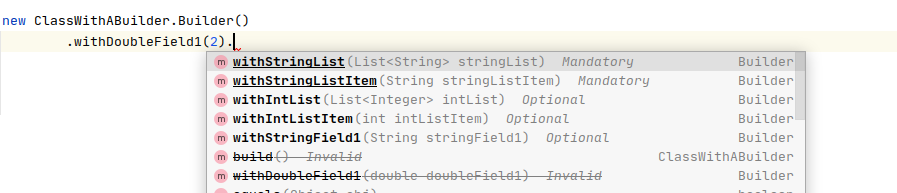

# Builder Guided Completion Plugin


[](https://plugins.jetbrains.com/plugin/PLUGIN_ID)
[](https://plugins.jetbrains.com/plugin/PLUGIN_ID)


<!-- Plugin description -->
Intellij Plugin to help you navigate how a [Builder](https://refactoring.guru/design-patterns/builder) should be invoked.
It allows the creator of the Builder API to specify what methods are mandatory and what methods can be invoked more than once.
The user of the Builder API will have a guided experience through the auto-completion popup which will mark what methods are mandatory, optional or invalid.
<!-- Plugin description end -->

## Installation

- Using IDE built-in plugin system:
  
  <kbd>Preferences</kbd> > <kbd>Plugins</kbd> > <kbd>Marketplace</kbd> > <kbd>Search for "mandatory-builder-fields-intellij-plugin"</kbd> >
  <kbd>Install Plugin</kbd>
  
- Manually:

  Download the [latest release](https://github.com/banterly91/Builder-Guided-Completion-Plugin/releases/latest) and install it manually using
  <kbd>Preferences</kbd> > <kbd>Plugins</kbd> > <kbd>⚙️</kbd> > <kbd>Install plugin from disk...</kbd>


##Usage
After installing this plugin, 4 annotations will be available for you and they should be used as follows:
#####@BuilderClass
Used to mark the builder class
```java
@BuilderClass
public class Builder{}
```
#####@MandatoryBuilderMethod
Used to mark the methods that must be called in order for the Builder to have enough data to construct a valid object. All methods not having this annotation are considered optional(except the build method)
```java
@BuilderClass
public class Builder {
// other Builder class code

@MandatoryBuilderMethod
public Builder withMandatoryValue(int mandatoryValue) {
// mandatory method code
}

public Builder withOptionalValue(int optionalValue) {
// optional method code
}
}
```

#####@RepeatableBuilderMethod
Used to mark the methods that can be called multiple times(e.g. a method that adds items to a list field). This can be applied to both optional and mandatory methods.
```java
@BuilderClass
public class Builder {
// other Builder class code

@RepeatableBuilderMethod
@MandatoryBuilderMethod
public Builder withMandatoryValue(int mandatoryValue) {
// mandatory method code
}

@RepeatableBuilderMethod
public Builder withOptionalValue(int optionalValue) {
// optional method code
}
}
```

#####@BuildMethod
Used to mark the build method of a builder.
```java
@BuilderClass
public class Builder {
// other Builder class code

@BuildMethod
public ClassWithBuilder build(){
// build method code
}
}
```

After annotating the Builder class, the completion popup will categorize all public methods in 3 groups:
* required methods: will be at the top of the list and presented in bold and underlined 
* optional methods: will be after the required methods in the list and presented only in bold with no underline
* invalid methods: will be at the bottom of the list and presented with a strikeout line



In general the grouping is done as you might expect, but for those curious the exact rules are these:
* **required methods**
    * methods marked with `@MandatoryBuilderMethod` that have not been invoked yet
    * method marked with `@BuildMethod` when all mandatory methods have been invoked
* **optional methods**
    * methods marked with no annotation that have not been invoked yet
    * methods marked with `@MandatoryBuilderMethod` and `@RepeatableBuilderMethod` that have been invoked at least once
    * methods marked only with `@RepeatableBuilderMethod`, regardless of the number of invocations
* **invalid methods**
    * methods not marked with `@RepeatableBuilderMethod` that have already been invoked
    * method marked with `@BuildMethod` when not all methods marked with `@MandatoryBuilderMethod`

##Roadmap
This is just the first version of the plugin, so it comes with a couple of limitations which are planned to be fixed, especially if this plugin starts getting some usage.
The following will likely be included in a future release:
#####Improve categorization algorithm 
Right now to determine what methods have been invoked or not we just look at all code present before the caret position, without taking into consideration possible if blocks or other constructs. This can be problematic in a couple of cases, like the following:
```java
/// other code
Builder = new ClassWithABuilder.Builder();
if(condition){
    builder.withNonRepeatableMandatoryField("value1");
} else {
    builder.withNonRepeatableMandatoryField("value2");
}
///other code
```
With the current way the plugin runs, when trying to get the completion list for the builder in the else branch of the if condition we would see the `withNonRepeatableMandatoryField` marked as invalid since we consider it called in the first branch which is obviously not correct. 
There are a couple of approaches to support more advances cases like this, and they are a priority for the next release.

#####Advanced Builder Guidance
We could have cases where a builder could have multiple construction paths. For example if `methodA` is called then we can call only `methodB` on the builder, but if `methodC` is called then only `methodD` can be further called on the Builder. This is also high on the priority list for the next release.

#####Paired methods
We can have cases where two methods could both satisfy a mandatory requirement, so after one is called the other one should be considered invalid or optional depending on the context.
Consider the following case:
```java
public class Builder {
    List<Integer> values = new ArrayList<>();
    
    @RepeatableBuilderMethod
    @MandatoryBuilderMethod
    public Builder withValue(int value){
        values.add(value);
        return this;
    }   

    @MandatoryBuilderMethod
    public Builder withValues(List<Integer> values){
        values.addAll(values);
        return this;
    }   
}
```
In the above case it makes sense that if `withValues` is called, we should not be required to call `withValue`. I like to call this ones as paired methods, and handling this case is also on the list for the next release.

#####Other Issues requested by users
If there are any other issues that are requested by the users, they will get priority first. 

If anyone wants to contribute via Pull Requests please do so.

---
Plugin based on the [IntelliJ Platform Plugin Template][template].

[template]: https://github.com/JetBrains/intellij-platform-plugin-template
